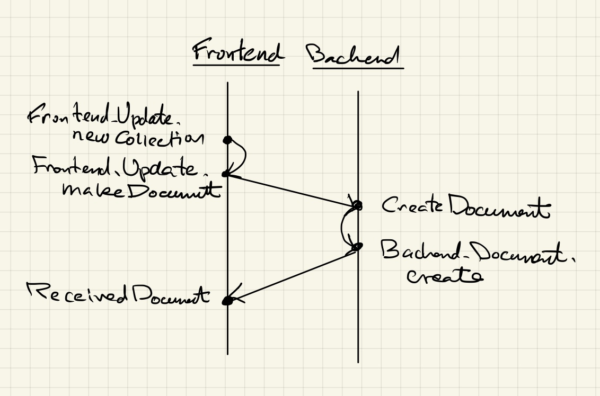
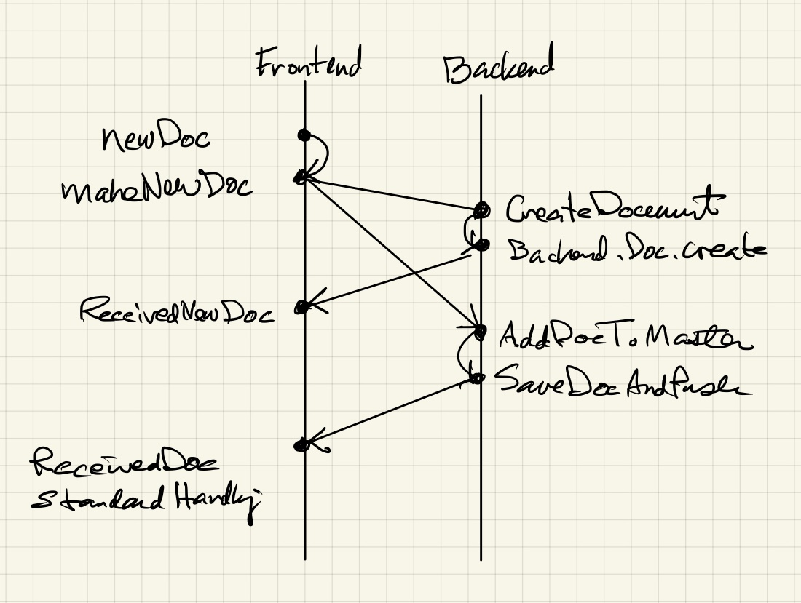

# Collection Documents

A collection document is a collection of links
to other documents.

## Example


Here is the source text:

```text
| title
Quantum Mechanics Notes

[tags jxxcarlson:quantum-mechanics-notes, collection]

| collection

| document jxxcarlson:qmnotes-trajectories-uncertainty
Trajectories and Uncertainty 

| document jxxcarlson:wave-packets-dispersion
Wave Packets and the Dispersion Relation

...
```

## About the document format

A collection document is normally written in the
[L0 markup language](/L0/)

The word `collection` must occur in the 
`tag` element, and the block `| collection`
is mandatory.

_Note to self: simplify this API!_

Following this block, there is a series of `| document`
blocks.  Such a block takes a single argument, which is
either the document id or the document slug, which 
has the form`USERNAME:REFERENCE`. The `document` blocks are rendered
as `ilinks` (internal links).  Internal links are handled
by Lamdera via websockets.  Http links would reload the
app, which is a bad idea.


## Creating a collection document

The bare-metal way to create and update a collection 
document is to create an ordinary document, then 
edit its text following the format described above.
One can also use the `New: Collection` button in the
Scripta app.  The button calls 
`Frontend.Update.newCollection`. Here, in pictures,
is the full data flow:


*Data flow for creating a collection document*

Continuing in words, `Frontend.Update.newCollection` calls
`Frontend.Update.makeDocument`, which invokes the command

```
Lamdera.sendToBackend (CreateDocument model.currentUser newDoc)
```

The message `CreateDocument` calls 
`Backend.Document.create`, which is responsible 
for creating the document, adding to the application
store, and sending the resulting document back to the
frontend via 

```
Lamdera.sendToFrontend clientId (ReceivedNewDocument handling doc)
```

## Adding a new document to a collection


