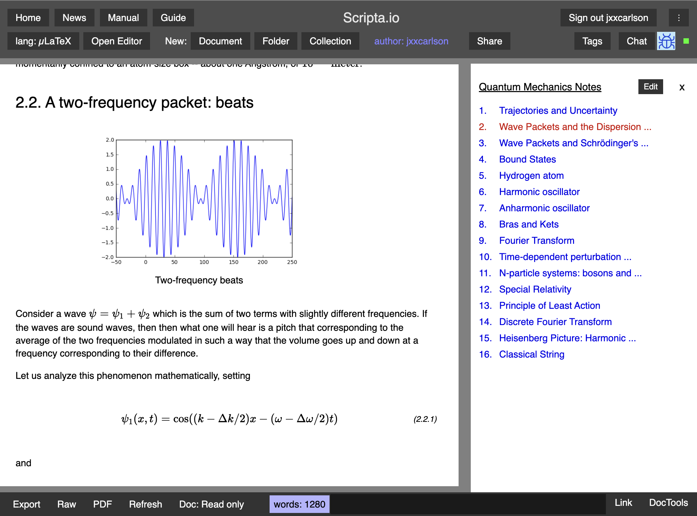
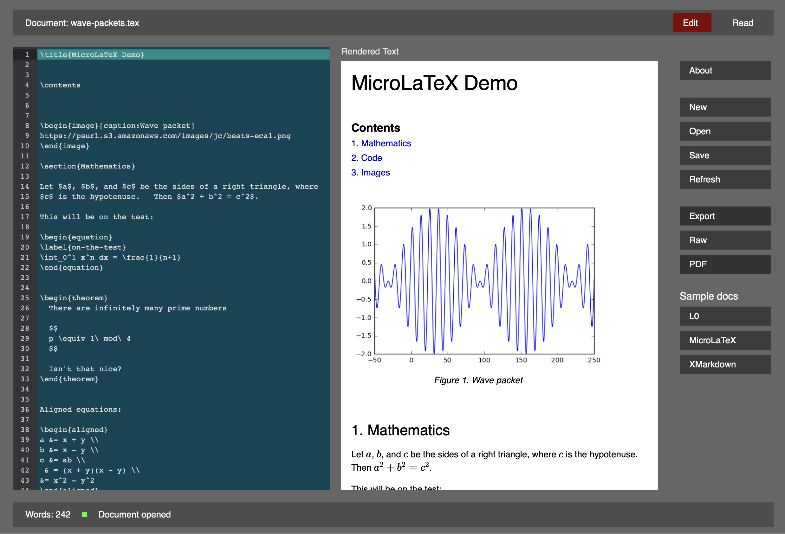

# The Scripta Project

Scripta is an editing and publishing system for technical
documents (mathematics, physics, etc.). It consists
of three components

- [Scripta.io](https://scripta.io), a web app
- [Scripta Desktop](https://github.com/jxxcarlson/scripta-tauri/releases), for 
  Mac OS (fat binary), soon to be cross-compiled for Linux and Windows.
- [The Scripta compiler](https://jxxcarlson.github.io/docs-scripta-compiler/) 

There is also a [very simple live demo app](https://jxxcarlson.github.io/scripta-compiler-example1/).
You can edit the text at will. Note, however, that this app 
does not have the advanced editing features offered by Scripta.io
and Scripta Desktop. 

All of the above are written in [Elm](https://elm-lang.org), a
pure functional language that compiles to Javascript.  See the 
Tech Stack  section below for more information.

(( This document is a work-in-progress and
will remain so for a good while. ))

## Screenshots

### Scripta.io, a notebbook document

[Direct link](https://scripta.io/s/jxxcarlson:wave-packets-dispersion)

### Scripta.io, an ordinary document

[Direct link](https://scripta.io/s/jxxcarlson:harmonic-oscillator)

### Scripta Desktop

[Download page](https://jxxcarlson.github.io/docs-scripta-compiler/)

## Compiler

The Scripta compiler supports three markup languages

- L0
- MicroLaTeX
- XMarkdown

L0 has a syntax inspired by Lisp; MicroLaTeX is
an implementation of LaTeX, and XMarkdown is
like Markdown, but with some extra features,
e.g., TeX-style mathematical text.

See this  [live example](https://jxxcarlson.github.io/scripta-compiler-example1/)
for a simple demonstration of microLaTeX 
([source code here](https://github.com/jxxcarlson/scripta-compiler/tree/main/Example1)). You can edit the text of the example app at will.
[Scripta.io](https://scripta.io) is a full-featured use case that
makes use of the compiler's error recovery facilities and which implements
synchronization of source and rendered text: click on rendered text to 
highlight and bring into view the corresponding source text; select
a block of source text and press ctrl-S (for "sync") to highlight the 
corresponding rendered text and bring it into view.

The compiler is open-source, with the code hosted on [Github](https://github.com/jxxcarlson/scripta-compiler))
and with [some documentation (work in progress)](https://jxxcarlson.github.io/docs-scripta-compiler/).
See also the [example source code](https://github.com/jxxcarlson/scripta-compiler/tree/main/Example1)

## Tech stack

Both the app and the compiler are written in 
[Elm](https://elm-lang.org), a pure functional language
that compiles to Javascript.  The app also uses
the [Lamdera](https://lamdera.com/) framework, which
permits one to write both the front and the backend in
Elm.  See this [short note on Lamdera](/docs-scripta-app/lamdera/).
Mathematical text is rendered using [KaTeX](https://katex.org) and
the editor relies on [Codemirror 6](https://codemirror.net/6/).
The interface to Elm for both of these is via custom elements.

## Web App

Most of this document concerns the web app and is 
intended to help the app developers.
The source code is not currently open-source, though
one day it might be.