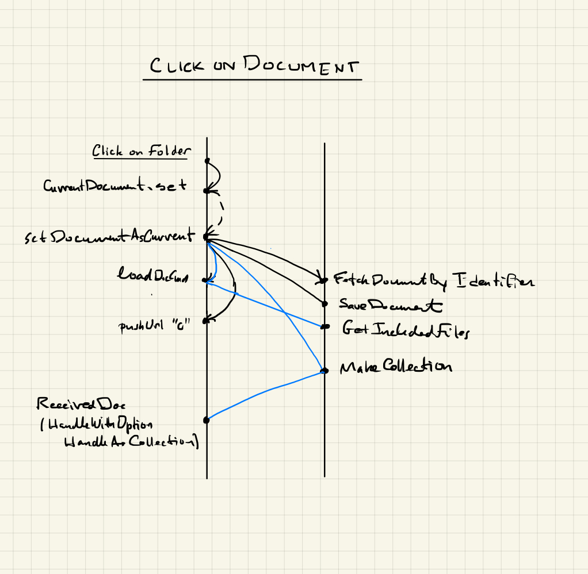

# Opening a document 

When a document is opened by clicking on it in the
index panel, it needs to be made current, that is,
`model.currentDocument` is set to the document in
question.  The functions for this operation are found in
module `Frontend.CurrentDocuent` and the flow of 
messages that this action initiates are set out
in the diagram below.  The blue lines are activated if
(1) there are additional documents to be loaded, e.g.,
macro files for microLaTeX documents or if (2) the 
document is is a collection document or live folder.

It is important in this process that the correct index
panel be used ...

